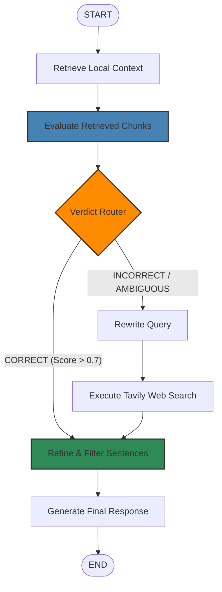

# Corrective-RAG (CRAG) Agent

A highly robust, production-grade Corrective-RAG (CRAG) microservice built with **LangGraph**, **FastAPI**, **Chroma**, and **DeepSeek**. It enables high-quality conversational question answering over localized PDF documentation, dynamically validating retrieval quality, correcting gaps with live web search, and generating context-filtered tutor responses.

---

## 🏗️ Architecture & Graph Flow

This project implements the **Corrective-RAG (CRAG)** architecture, which adds a strict quality validation and self-correction layer to standard retrieval pipelines.



### Routing Decisions
- **`CORRECT`**: At least one local document chunk scores `> 0.7` (upper threshold). The agent uses the local chunks directly, bypassing any external web requests.
- **`INCORRECT`**: All retrieved chunks score `< 0.3` (lower threshold). The agent marks the local database as completely stale/irrelevant, rewrites the query, and shifts entirely to Tavily-backed web results.
- **`AMBIGUOUS`**: Mixed or mediocre retrieval scores. The agent merges the highest-scoring local chunks with real-time web results to compile a comprehensive knowledge base.

---

## ✨ Features

- ⚡ **Lightning Fast Indexing**: Integrates `DirectoryLoader` with `PyMuPDFLoader` to parse local PDFs up to 10x faster than standard PDF loaders.
- 💾 **Persistent Vector DB**: Uses **Chroma** persistent storage (`chroma_db/`) to load existing document indices instantly on startup.
- 🔍 **Strict Relevance Filtering**: Before generating the final response, the `refine` node decomposes all retrieved contexts into individual sentences and runs a strict binary LLM grader to filter out non-relevance.
- 🌐 **Real-time Recovery**: Plugs in **Tavily Web Search** to retrieve fresh, external documents dynamically if the local database lacks coverage.
- 💬 **Multi-Turn Context**: Fully supports `chat_history` payload tracking to hold highly contextual, natural conversational history.

---

## 🛠️ Stack & Dependencies

- **Framework**: LangGraph, LangChain Core, LangChain Community
- **LLM**: DeepSeek Chat API (`ChatDeepSeek`)
- **Vector DB**: Chroma (`langchain-chroma`)
- **Embeddings**: FastEmbed (`FastEmbedEmbeddings`)
- **Search API**: Tavily Search (`langchain-tavily`)
- **Web Server**: FastAPI, Uvicorn, Pydantic v2
- **Environment**: Python, `uv` manager

---

## 🚀 Setup & Installation

### 1. Prerequisites
Ensure you have the `uv` tool installed (the fast Python package manager):
```bash
powershell -c "irm https://astral.sh/uv/install.ps1 | iex"
```

### 2. Environment Configuration
Create a `.env` file in the root directory:
```env
DEEPSEEK_API_KEY = "your-deepseek-api-key"
TAVILY_API_KEY = "your-tavily-api-key"
```

### 3. Document Preparation
Place the PDF reference files you want to answer questions about inside the `documents/` directory:
```text
documents/
├── Magnifica_Humanitas.pdf
└── Pope_Leo_XIV.pdf
```
*(Any PDFs placed here are automatically scanned, chunked, and stored during initialization).*

---

## 🏃 Running the Application

### Start the Microservice
Launch the FastAPI development server:
```bash
uv run uvicorn api.server:app --port 8000 --reload
```
Upon startup, the microservice will:
- Instantly load the Chroma index if it already exists.
- Dynamically build and persist a new vector index if `chroma_db/` is missing.

---

## 📡 API Endpoints

### 🟢 `GET /health`
Liveness check to ensure the microservice is operational.

**Example Response**:
```json
{
  "status": "ok"
}
```

### 🔵 `POST /chat`
Execute a query through the Corrective-RAG LangGraph agent.

#### Request Body
```json
{
  "query": "Who is Pope Leo XIV?",
  "chat_history": [
    {
      "role": "human",
      "content": "Hello! I have some questions."
    },
    {
      "role": "ai",
      "content": "Of course! Let's explore your documents."
    }
  ]
}
```

#### Example Responses

##### 1. Retrieved from local documents (`CORRECT` Path):
```json
{
  "answer": "Based on the provided context, Pope Leo XIV (born Robert Francis Prevost) is the head of the Catholic Church and sovereign of Vatican City. He is the first pope born in the United States, the first from the Order of Saint Augustine, and the second pope from the Americas.",
  "verdict": "CORRECT",
  "reason": "At least one retrieved chunk scored > 0.7.",
  "web_query": null
}
```

##### 2. Retrieved from web search fallback (`INCORRECT` Path):
```json
{
  "answer": "India won the 2024 ICC Men's T20 World Cup, defeating South Africa in the final.",
  "verdict": "INCORRECT",
  "reason": "All retrieved chunks scored < 0.3.",
  "web_query": "2024 ICC Men's T20 World Cup winner"
}
```

---

## 🧹 Maintenance

### Force Re-indexing
To clear the persisted store and force a complete rebuild of the vector database (e.g. after adding/updating files in `documents/`), run:
```bash
# Windows (PowerShell)
Remove-Item -Recurse -Force .\chroma_db

# Linux / macOS
rm -rf chroma_db/
```
Then, restart the server.
